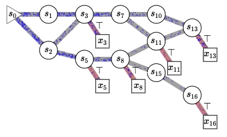

# GFlowNet in PyTorch



This repo contains an implementation of the Generative Flow Net (GFlowNet) architecture proposed by Bengio et al. in the paper ["Flow Network based Generative Models for Non-Iterative Diverse Candidate Generation"](https://arxiv.org/abs/2106.04399) (2021).

The model is trained using online learning (i.e. by continually evaluating samples drawn from the model's own policy rather than a fixed set of samples drawn from another policy) and the [trajectory balance loss](https://arxiv.org/abs/2201.13259). We evaluate the model's performance using the grid domain of the original paper. This is visualized by the end of training.

The code for training the model is simple:

1. Initialize the grid environment using a grid size
2. Define a policy network taking a state (represented by a vector) as input and outputting a vector of probabilities over possible actions. (In the grid domain, the number of actions is three: **Down**, **Right**, and **Terminate**.)
3. Define a backward policy; in this case, the policy is not estimated but fixed to 0.5 for all parent states (except when the parent state is the only one possible).

With this, you initialize the GFlowNet along with the optimizer to use during training.

```python
env = Grid(size=16, num_actions=3)
forward_policy = ForwardPolicy(env.state_dim, hidden_dim=128, num_actions=3)
model = GFlowNet(forward_policy, backward_policy, env)
opt = Adam(model.parameters(), lr=5e-3)
```

To train the model, construct an NxD matrix of initial states, where N is the desired number of samples and D is the dimensionality of the state vector. Then, draw samples from the model using the method `sample_states(...)`, giving it the initial states and setting `return_stats=True`. The `Stats` object contains information about the trajectory of each sample, which is used to compute the trajectory balance loss.

```python
for i in (p := tqdm(range(num_epochs))):
  s0 = one_hot(torch.zeros(batch_size).long(), env.state_dim).float()
  s, stats = model.sample_states(s0, return_stats=True)
  loss = trajectory_balance_loss(stats.total_flow,
                                 stats.rewards,
                                 stats.fwd_probs,
                                 stats.back_probs)
  loss.backward()
  opt.step()
  opt.zero_grad()
```

Finally, when the model has been trained, you can samples states using the same `sample_states(...)` method as before, this time without supplying the `return_stats=True` argument.

```python
s0 = one_hot(torch.zeros(10**4).long(), env.state_dim).float()
s, _ = model.sample_states(s0)
```
